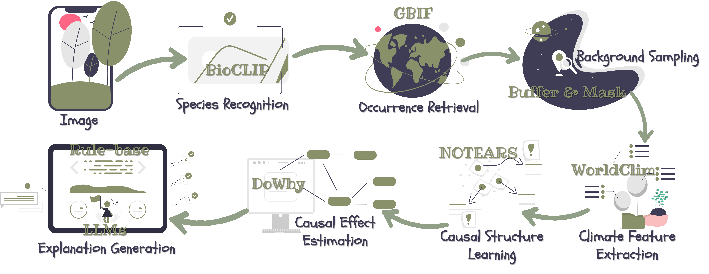

 

<div align=center>
<p>

# From Images to Insights: Explainable Biodiversity Monitoring with Plain Language Habitat Explanations

*An End-to-End Framework for Interpretable Ecological Inference*

**🔬 Species recognition → Causal analysis of habitat preferences → Human-readable ecological explanations**

[![Paper Download](https://img.shields.io/badge/Paper-Download-90B44B?logo=data:image/svg%2bxml;base64,PHN2ZyBpZD0iTGF5ZXJfMSIgZW5hYmxlLWJhY2tncm91bmQ9Im5ldyAwIDAgNTEwIDUxMCIgaGVpZ2h0PSI1MTIiIHZpZXdCb3g9IjAgMCA1MTAgNTEwIiB3aWR0aD0iNTEyIiB4bWxucz0iaHR0cDovL3d3dy53My5vcmcvMjAwMC9zdmciPjxnPjxnPjxwYXRoIGQ9Im0xNzQuNjEgMzAwYy0yMC41OCAwLTQwLjU2IDYuOTUtNTYuNjkgMTkuNzJsLTExMC4wOSA4NS43OTd2MTA0LjQ4M2g1My41MjlsNzYuNDcxLTY1aDEyNi44MnYtMTQ1eiIgZmlsbD0iI2ZmZGRjZSIvPjwvZz48cGF0aCBkPSJtNTAyLjE3IDI4NC43MmMwIDguOTUtMy42IDE3Ljg5LTEwLjc4IDI0LjQ2bC0xNDguNTYgMTM1LjgyaC03OC4xOHYtODVoNjguMThsMTE0LjM0LTEwMC4yMWMxMi44Mi0xMS4yMyAzMi4wNi0xMC45MiA0NC41LjczIDcgNi41NSAxMC41IDE1LjM4IDEwLjUgMjQuMnoiIGZpbGw9IiNmZmNjYmQiLz48cGF0aCBkPSJtMzMyLjgzIDM0OS42M3YxMC4zN2gtNjguMTh2LTYwaDE4LjU1YzI3LjQxIDAgNDkuNjMgMjIuMjIgNDkuNjMgNDkuNjN6IiBmaWxsPSIjZmZjY2JkIi8+PHBhdGggZD0ibTM5OS44IDc3LjN2OC4wMWMwIDIwLjY1LTguMDQgNDAuMDctMjIuNjQgNTQuNjdsLTExMi41MSAxMTIuNTF2LTIyNi42NmwzLjE4LTMuMTljMTQuNi0xNC42IDM0LjAyLTIyLjY0IDU0LjY3LTIyLjY0IDQyLjYyIDAgNzcuMyAzNC42OCA3Ny4zIDc3LjN6IiBmaWxsPSIjZDAwMDUwIi8+PHBhdGggZD0ibTI2NC42NSAyNS44M3YyMjYuNjZsLTExMi41MS0xMTIuNTFjLTE0LjYtMTQuNi0yMi42NC0zNC4wMi0yMi42NC01NC42N3YtOC4wMWMwLTQyLjYyIDM0LjY4LTc3LjMgNzcuMy03Ny4zIDIwLjY1IDAgNDAuMDYgOC4wNCA1NC42NiAyMi42NHoiIGZpbGw9IiNmZjRhNGEiLz48cGF0aCBkPSJtMjEyLjgzIDM2MC4xMnYzMGg1MS44MnYtMzB6IiBmaWxsPSIjZmZjY2JkIi8+PHBhdGggZD0ibTI2NC42NSAzNjAuMTJ2MzBoMzYuMTRsMzIuMDQtMzB6IiBmaWxsPSIjZmZiZGE5Ii8+PC9nPjwvc3ZnPg==)](https://arxiv.org/abs/2506.10559)

</p>
</div>

##  Contents

* [** News**](#head1)
* [** Overview**](#head2)
* [**  Code Structure**](#head3)
* [**  Getting Started**](#head4)
* [**  Citation**](#head5)
* [** Acknowledgements**](#head6)

## <span id="head1">  News </span>


## <span id="head2">  Overview </span>

 

**BioX** is an ecological AI pipeline that transforms species images into causal habitat insights.
It contains:

1. 🔍 Species recognition from images (via **BioCLIP**)
2. 🌍 Presence & background point collection (via **GBIF + Spatial Sampling**)
3. 🌦️ Bioclimatic variable extraction (BIO1–BIO19 from **WorldClim**)
4. 🔗 Causal graph discovery among climate variables (via **NOTEARS**)
5. 📈 Causal inference on species presence and climate variables (via **DoWhy**)
6. 📖 Explanation generation in nature language (Rule-based or LLMs)

## <span id="head3">  Code Structure </span>

- `run.py`: Run the full pipeline from image to explanation.
- `config.py`: Configuration for paths, model params, etc.
- `modules/`: All core modules
  - `species_recognition.py`: Run BioCLIP on input images
  - `data_collection.py`: Get GBIF data (`gbif_extractor.py`), background points (`background_generator.py`), and BIO variables (`bioclim_extractor.py`).
  - `notears_bios.py`: Learn causal structure among BIOs
  - `bio2p_dowhy.py`: Perform causal inference with DoWhy
  - `explain.py`: Generate human-readable habitat explanations
- `utils/logger_setup.py`: Unified logging.
- `test/`: Just put input image(s) here.
- `requirements.txt`: Python dependencies

## <span id="head4">  Getting Started </span>

### 0. System Requirements (Example Setup)
* Microsoft Windows 11
* Python version: 3.10
* PyTorch version: 2.7.0 ([Official Website](https://pytorch.org/get-started/locally/))
* CUDA version: 11.8
* GPU: NVIDIA RTX A5000

### 1. Installation
Clone the repo and create a virtual environment:

```bash
git clone https://github.com/Yutong-Zhou-cv/BioX.git
cd BioX
conda env create -f environment.yaml
conda activate gta
pip install -r requirements.txt
```

### 2. Prepare Image(s)
Place your species image(s) in the `test/` folder.
Supported formats: "jpg", "png", "jpeg", "bmp".

### 3. Explanation Modes
In `config.py`, set the explanation mode:

```bash
EXPLAIN_PARMS = {
    "explanation_mode": "llm",  # "llm" or "rule"
    "llm_model": "llama3.3:70b"
}
```

`"llm"`: Use LLM (e.g., LLaMA3) to generate rich, biologically grounded narratives.

`"rule"`: Use concise, template-based explanations for speed or offline use.

### 4. Testing
```bash
python -m run.py
```

## <span id="head5">  Citation </span>

If you use **BioX** in your research, please cite:

> Zhou, Y. & Ryo, M. (2025). *From Images to Insights: Explainable Biodiversity Monitoring with Plain Language Habitat Explanations*.  
> [arXiv:2506.10559v1](https://arxiv.org/abs/2506.10559v1)

```bibtex
@misc{zhou2025biox,
      title={From Images to Insights: Explainable Biodiversity Monitoring with Plain Language Habitat Explanations}, 
      author={Yutong Zhou and Masahiro Ryo},
      year={2025},
      eprint={2506.10559},
      archivePrefix={arXiv},
      primaryClass={cs.CV},
      url={https://arxiv.org/abs/2506.10559}, 
}
```

## <span id="head6">  Acknowledgements </span>
> **“If I have seen further, it is by standing on the shoulders of giants.”** – Isaac Newton

This project builds upon a rich ecosystem of open ecological, statistical, and machine-learning tools. We are deeply grateful to the scientific community for the foundational contributions:
* **BioCLIP: A Vision Foundation Model for the Tree of Life**, Samuel Stevens et al. [[Paper](https://openaccess.thecvf.com/content/CVPR2024/html/Stevens_BioCLIP_A_Vision_Foundation_Model_for_the_Tree_of_Life_CVPR_2024_paper.html)] [[Project](https://imageomics.github.io/bioclip/)] 
```bibtex
@inproceedings{stevens2024bioclip,
  title={Bioclip: A vision foundation model for the tree of life},
  author={Stevens, Samuel and Wu, Jiaman and Thompson, Matthew J and Campolongo, Elizabeth G and Song, Chan Hee and Carlyn, David Edward and Dong, Li and Dahdul, Wasila M and Stewart, Charles and Berger-Wolf, Tanya and others},
  booktitle={Proceedings of the IEEE/CVF conference on computer vision and pattern recognition},
  pages={19412--19424},
  year={2024}
}
```

* **GBIF | Global Biodiversity Information Facility** [[Website](https://www.gbif.org/)]
* **WorldClim | Global climate and weather data** [[Website](https://www.worldclim.org/data/index.html)]
* **Natural Earth | Land** [[Website](https://www.naturalearthdata.com/downloads/10m-physical-vectors/10m-land/)]
* **DAGs with NO TEARS: Continuous Optimization for Structure Learning**, Xun Zheng et al. [[Paper](https://proceedings.neurips.cc/paper/2018/hash/e347c51419ffb23ca3fd5050202f9c3d-Abstract.html)] [[Code](https://github.com/xunzheng/notears)]
```bibtex
@inproceedings{zheng2018dags,
    author = {Zheng, Xun and Aragam, Bryon and Ravikumar, Pradeep and Xing, Eric P.},
    booktitle = {Advances in Neural Information Processing Systems},
    title = {DAGs with NO TEARS: Continuous Optimization for Structure Learning},
    year = {2018}
}
```

* **DoWhy: An End-to-End Library for Causal Inference**, Sharma Amit and Kiciman Emre. [[Paper](https://proceedings.neurips.cc/paper/2018/hash/e347c51419ffb23ca3fd5050202f9c3d-Abstract.html)] [[Code](https://github.com/py-why/dowhy)]
```bibtex
@misc{sharma2020dowhyendtoendlibrarycausal,
      title={DoWhy: An End-to-End Library for Causal Inference}, 
      author={Amit Sharma and Emre Kiciman},
      year={2020},
      eprint={2011.04216},
      archivePrefix={arXiv},
      primaryClass={stat.ME},
      url={https://arxiv.org/abs/2011.04216}, 
}
```
